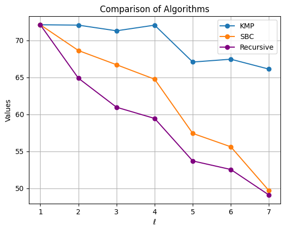

# PKP Complexity Estimation

This is an accompanying repository to the paper _Recursion Enabled: Improved Cryptanalysis of the Permuted Kernel Problem_ by Alessandro Budroni, Marco Defranceschi and Federico Pintore.

The repository provides Python scripts to visualize and compare the complexities of different algorithms to solve the Permuted Kernel Problem — specifically **KMP**, **SBC**, and our proposed recursive algorithm.

## Usage

The main entry point is the `generate_plot.py` script.

You can run it as follows:

```bash
python3 generate_plot.py --n 40 --r 20
```
where `--n` is the length of the public matrix `H` and `--r` is the dimension. The script will compute the complexity of the _KMP_, _SBC_ and our recursive algorithm
for all values of `ell` such that the minimum field size `q` is greater than `2`.

The script also generates a plot automatically saved as:
```
plot_n_40_r_20.png
```

For the above example, the output is:

<p align="center">
  
</p>

The other scripts `kmp.py`, `sbc.py` and `recursive_algorithm.py` allows to compute the complexity of the corresponding algorithm for a single parameter set `(n,r,ell,q)`.
